# PayNaija Support Desk on AWS

A small support ticket app, taken from a zip file on a laptop to a live site on a real domain with HTTPS. The infrastructure is built with Terraform, the app is packaged with Docker, and every push to `main` is deployed automatically with GitHub Actions.

I built this while learning cloud and DevOps, so the whole setup is written to be readable and repeatable by another beginner. If you want the full story, including every mistake I made along the way, the complete walkthrough is on Hashnode:

**[Deploying the PayNaija App on AWS: A Beginner's Guide](https://dmlops.hashnode.dev/deploying-the-paynaija-app-on-aws-a-beginner-s-guide)**

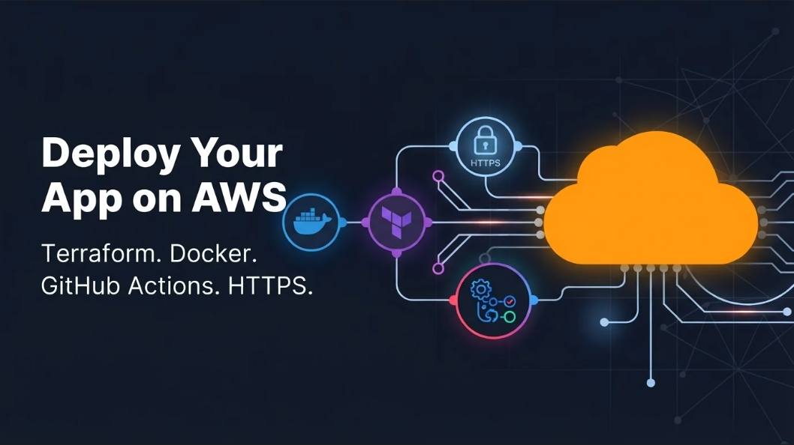

## Project Overview

PayNaija Support Desk is a simple ticket tracker with a React frontend, a Node.js and Express API, and a PostgreSQL database. The app itself is small on purpose. The real goal of this project is everything around it: getting it running the same way on a laptop and on a server, creating the cloud resources from code instead of clicking through the console, and letting a pipeline handle deployments so nobody has to SSH in by hand.

Here is the path a request takes once everything is running:

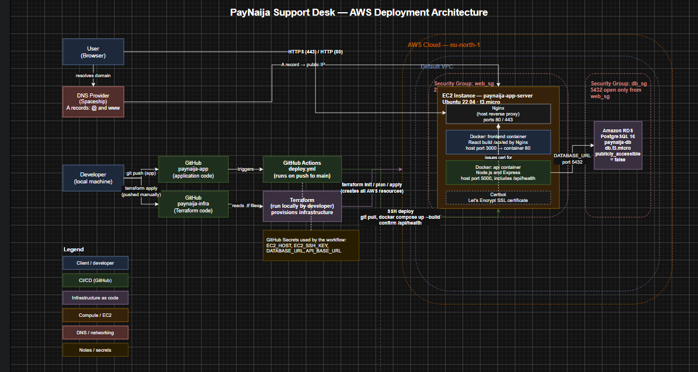


## Technologies Used

| Area | Tool | What it does here |
| :--- | :--- | :--- |
| Frontend | React with Vite | The user interface, built into static files |
| Frontend server | Nginx (in Docker) | Serves the built React app inside the container |
| Backend | Node.js and Express | The REST API, including the health check |
| Database | PostgreSQL on Amazon RDS | Stores the ticket data, kept private |
| Compute | Amazon EC2 (Ubuntu 22.04) | Runs the containers |
| Infrastructure as code | Terraform | Creates the server, database, security groups and key pair |
| Containers | Docker and Docker Compose | Packages the frontend and backend |
| CI/CD | GitHub Actions | Rebuilds and redeploys on every push to `main` |
| Reverse proxy | Nginx (on the server) | Routes traffic to the right container under one domain |
| HTTPS | Certbot and Let's Encrypt | Free SSL certificate with automatic renewal |
| DNS | Spaceship | Points the domain to the server |

## Project Structure

I split this into two repositories on purpose. The app and the infrastructure change for different reasons, and keeping them apart meant I could break one without touching the other.

**paynaija-app** is the application repo. The `backend` folder holds the Express API in `index.js`, its `package.json` and a Dockerfile. The `frontend` folder holds the React source and its own Dockerfile, which builds the app with Vite and then hands the result to Nginx. At the root you will find `docker-compose.yml`, which starts both containers together, and a `.gitignore` that keeps secrets out of Git. The deployment pipeline sits in `.github/workflows/deploy.yml`.

**paynaija-infra** is the Terraform repo. `providers.tf` tells Terraform to use AWS, and `variables.tf` holds the region, instance sizes and database settings. `main.tf` is where the real work happens: the security groups, the RDS database, the key pair and the EC2 server. `outputs.tf` prints the server IP and database endpoint once everything is built. You also create a `terraform.tfvars` file yourself for the database password, and it never gets committed.

## Main Features

**Containerized frontend and backend.** Both services have their own Dockerfile, and Docker Compose starts them together. The frontend uses a two stage build so the final image only contains the finished static files.

**Infrastructure created from code.** Terraform provisions an EC2 server, a PostgreSQL database on RDS, two security groups, a database subnet group and an SSH key pair. A normal plan shows 6 resources to add.

**A private database.** The RDS instance is not publicly accessible, and its security group only accepts traffic from the app server's security group. Two layers protect it.

**A health check endpoint.** `GET /api/health` lets the pipeline confirm the backend is alive after every deploy.

**Automatic deployments.** Every push to `main` connects to the server over SSH, pulls the latest code, rewrites the `.env` file from GitHub secrets and rebuilds the containers. The last step calls the health check and fails loudly if the app does not respond.

**One domain for everything.** A host level Nginx sends `/` to the frontend and `/api/` to the backend, so visitors only ever see your domain.

**HTTPS with automatic renewal.** Certbot issues a free certificate and edits the Nginx config for you.

## Prerequisites

Before you start, make sure you have these ready.

1. The PayNaija project zip file
2. Docker Desktop, Git, Terraform and the AWS CLI installed
3. An AWS account
4. A GitHub account
5. A domain name with access to its DNS settings

I ran every command in Git Bash. Anything in angle brackets, like `<app_server_public_ip>`, is a placeholder you replace with your own value.

## Setup Instructions

### 1. Prepare the app and run it locally

Unzip straight into a folder you created, so you avoid the extra nested folder that macOS zips tend to produce:

```bash
cd ~/Downloads
mkdir paynaija-support-desk
cd paynaija-support-desk
unzip ~/Downloads/PayNaija.zip -d .
```

If you still end up with a nested `PayNaija` folder or `__MACOSX` files, clean up like this:

```bash
cd PayNaija
mv frontend backend docker-compose.yml README.md ..
cd ..
rm -rf PayNaija __MACOSX ._?*
```

Add the two Dockerfiles, make sure `backend/package.json` lists its dependencies, and check that `backend/index.js` has an `/api/health` route. If the route already exists, leave it as it is. The frontend maps to port 3000 in `docker-compose.yml` so that port 80 stays free for the server's Nginx later.

Then start everything and test it:

```bash
docker compose up -d --build
docker compose ps
curl http://localhost:5000/api/health
```

You should see `{"status":"ok"}`. When it works, run `docker compose down`.

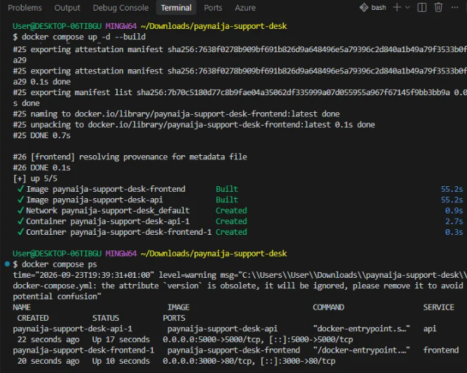

### 2. Push the app to GitHub

Create a `.gitignore` containing `node_modules/`, `.env`, `*.tfstate`, `*.tfstate.*` and `.terraform/`. Then push:

```bash
git init
git add .
git commit -m "Initial commit - PayNaija app starter"
git branch -M main
git remote add origin https://github.com/<your-username>/paynaija-app.git
git push -u origin main
```

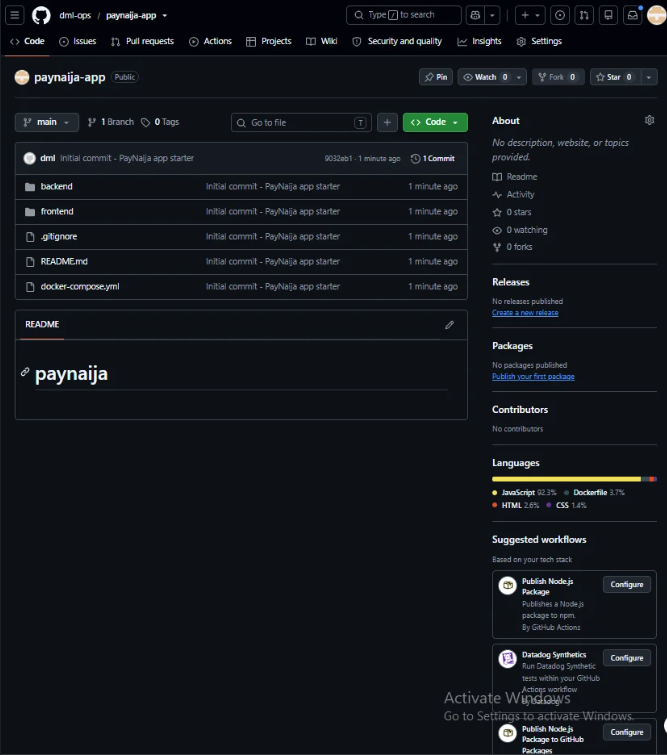

### 3. Configure the AWS CLI

Create an access key in the AWS console (Security Credentials, then Access keys, then Create access key, then Command Line Interface). Copy the secret straight away because AWS only shows it once.

```bash
aws configure
aws sts get-caller-identity
terraform --version
```

Use a region close to you. I used `eu-north-1`.

### 4. Provision the infrastructure with Terraform

Create the separate `paynaija-infra` folder, add the four `.tf` files, and generate the SSH key pair Terraform will attach to the server:

```bash
ssh-keygen -t rsa -b 4096 -f ~/.ssh/paynaija_key
```

Create `terraform.tfvars` with a database password. Use letters and numbers only, because characters like `$` and `@` cause trouble once the password sits inside a connection string. Add `terraform.tfvars` to the infra `.gitignore` so it never reaches GitHub.

```bash
terraform init
terraform fmt
terraform validate
terraform plan
terraform apply
terraform output
```

The plan should read `6 to add, 0 to change, 0 to destroy`. RDS takes a few minutes to become available. Save the `app_server_public_ip` and `db_endpoint` values from the output.

The full contents of every Terraform file are in the Hashnode walkthrough linked above.

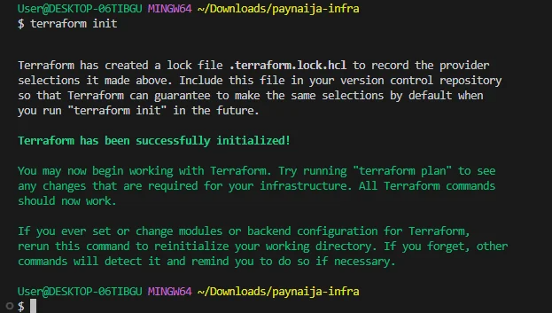

### 5. Verify the resources in the AWS Console

Set the console to your region and confirm four things: `paynaija-app-server` is running under EC2 Instances, `paynaija-db` is available under RDS Databases, `web_sg` and `db_sg` exist under Security Groups, and `paynaija-key` exists under Key Pairs.

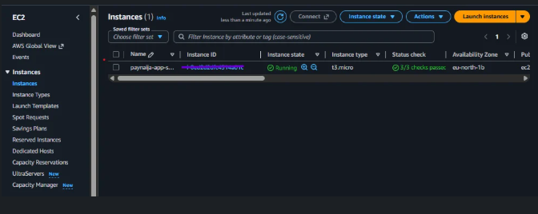

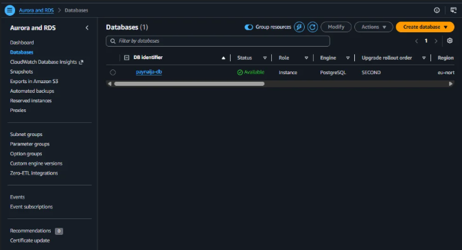

### 6. Deploy manually once

Doing the first deployment by hand helps you understand what the pipeline automates later.

```bash
ssh -i ~/.ssh/paynaija_key ubuntu@<app_server_public_ip>
```

Install Docker on the server:

```bash
sudo apt update && sudo apt upgrade -y
sudo apt-get install -y ca-certificates curl gnupg
sudo install -m 0755 -d /etc/apt/keyrings
sudo curl -fsSL https://download.docker.com/linux/ubuntu/gpg -o /etc/apt/keyrings/docker.asc
sudo chmod a+r /etc/apt/keyrings/docker.asc

echo \
  "deb [arch=$(dpkg --print-architecture) signed-by=/etc/apt/keyrings/docker.asc] \
  https://download.docker.com/linux/ubuntu \
  $(. /etc/os-release && echo "$VERSION_CODENAME") stable" | \
  sudo tee /etc/apt/sources.list.d/docker.list > /dev/null

sudo apt-get update
sudo apt-get install -y docker-ce docker-ce-cli containerd.io docker-buildx-plugin docker-compose-plugin
sudo systemctl start docker
sudo systemctl enable docker
sudo usermod -aG docker $USER
newgrp docker
```

Clone the app and create the production `.env` file. Leave the `:5432` off the endpoint host, since the port is already written into the command:

```bash
git clone https://github.com/<your-username>/paynaija-app.git
cd paynaija-app

printf 'DATABASE_URL=postgresql://paynaija_admin:<db_password>@<db_endpoint_host>:5432/paynaija\nAPI_BASE_URL=http://<app_server_public_ip>:5000\n' > .env

cat -A .env
```

Build, run and check:

```bash
docker compose --env-file .env up -d --build
docker compose ps
curl -i http://localhost:5000/api/health
```

From your own browser, open `http://<app_server_public_ip>:5000/api/health` and `http://<app_server_public_ip>:3000`. When both respond, run `docker compose down` and let the pipeline take over.

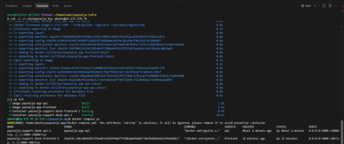

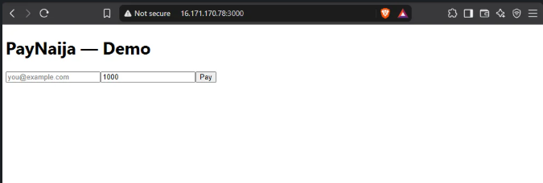

### 7. Point your domain at the server

In your DNS provider, add two A records that both use your server's public IP as the value. Set one host to `@` and the other to `www`. DNS changes can take a few minutes to spread.

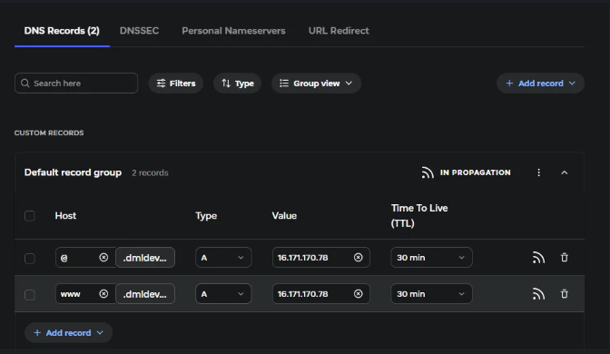

### 8. Set up GitHub Actions

In the app repository, open Settings, then Secrets and variables, then Actions, and add these repository secrets:

| Secret | Value |
| :--- | :--- |
| `EC2_HOST` | Your server's public IP |
| `EC2_SSH_KEY` | The full contents of `~/.ssh/paynaija_key`, including the BEGIN and END lines |
| `DATABASE_URL` | `postgresql://paynaija_admin:<db_password>@<db_endpoint_host>:5432/paynaija` |
| `API_BASE_URL` | `http://<app_server_public_ip>:5000` for now, changed to your domain later |

Then add `.github/workflows/deploy.yml` to the app repository. The workflow runs on every push to `main` and can also be started manually. It has three jobs in order: prepare the SSH key, deploy over SSH, and confirm the health check. The complete file is in the Hashnode walkthrough.

Commit it to `main` and watch the Actions tab. It should go green.

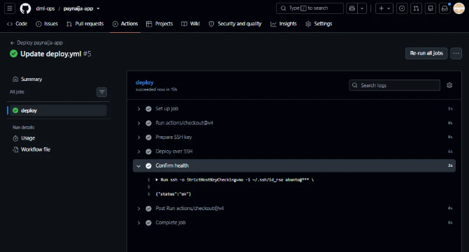

### 9. Add the Nginx reverse proxy

On the server, install Nginx outside Docker:

```bash
sudo apt install nginx -y && sudo systemctl enable nginx
```

Create the site config, swapping `yourdomain.com` for your own domain. The quoted `'EOF'` stops bash from trying to expand `$host` and friends.

```bash
sudo tee /etc/nginx/sites-available/paynaija > /dev/null << 'EOF'
server {
    listen 80;
    server_name yourdomain.com www.yourdomain.com;

    location / {
        proxy_pass http://localhost:3000;
        proxy_set_header Host $host;
        proxy_set_header X-Real-IP $remote_addr;
        proxy_set_header X-Forwarded-For $proxy_add_x_forwarded_for;
        proxy_set_header X-Forwarded-Proto $scheme;
    }

    location /api/ {
        proxy_pass http://localhost:5000/api/;
        proxy_set_header Host $host;
        proxy_set_header X-Real-IP $remote_addr;
        proxy_set_header X-Forwarded-For $proxy_add_x_forwarded_for;
        proxy_set_header X-Forwarded-Proto $scheme;
    }
}
EOF

sudo ln -s /etc/nginx/sites-available/paynaija /etc/nginx/sites-enabled/
sudo rm -f /etc/nginx/sites-enabled/default
sudo nginx -t
sudo systemctl reload nginx
```

Now update the `API_BASE_URL` secret in GitHub to `https://yourdomain.com/api` and run the deploy workflow again so the frontend picks up the new value.

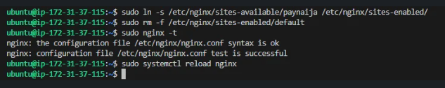

### 10. Turn on HTTPS

```bash
sudo apt install certbot python3-certbot-nginx -y
sudo certbot --nginx -d yourdomain.com -d www.yourdomain.com
sudo certbot renew --dry-run
sudo systemctl reload nginx
```

Certbot will ask for your email and for you to accept the terms. From your laptop, confirm it works:

```bash
curl -Iv https://yourdomain.com
```

You should get a `200 OK`.

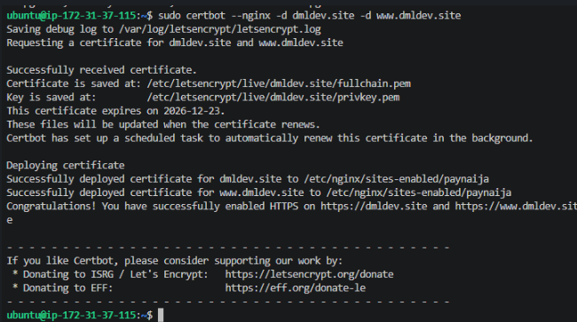

## Workflow Usage Guide

Once setup is finished, day to day use is simple.

**Deploying a change.** Commit your work and push to `main`. GitHub Actions connects to the server, pulls the code, rebuilds the containers and checks the health endpoint. You can follow it live in the Actions tab.

**Running a deploy without a code change.** Open the Actions tab, choose the deploy workflow and use Run workflow. This is handy after you update a secret such as `API_BASE_URL`.

**Checking that the app is healthy.** Visit `https://yourdomain.com/api/health` in a browser or run `curl -i https://yourdomain.com/api/health`. A healthy backend replies with a `200` status.

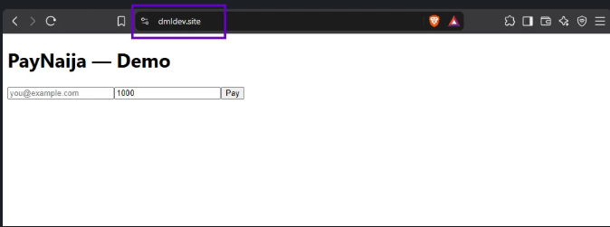


**Looking at logs when something is wrong.** SSH into the server and run these:

```bash
docker compose ps
docker compose logs frontend
docker compose logs api
sudo journalctl -u nginx -n 50
```

**Changing infrastructure.** Edit the Terraform files in the `paynaija-infra` repository, then run `terraform plan` to preview and `terraform apply` to make the change. The pipeline never touches infrastructure. It only updates the app on the server that already exists.

**Cleaning up when you are done.** EC2 and RDS cost money while they run. From the `paynaija-infra` folder, run:

```bash
terraform destroy
```

## Troubleshooting

Here are the problems I actually ran into, and what fixed them.

| Problem | Cause | Fix |
| :--- | :--- | :--- |
| The health route works but the frontend on port 3000 will not load | The `web_sg` security group had no ingress rule for port 3000 | Add the port 3000 ingress block to `main.tf` and run `terraform apply` again |
| The `.env` file is corrupted after a deploy | An indented heredoc never found its closing `EOF` | Build the file with a single `printf` line, or use a quoted heredoc |
| The database connection fails with a correct looking password | A `$` in the password was read as a shell variable and removed | Use a password with letters and numbers only |
| Nested `PayNaija` folder after unzipping | macOS adds an extra folder and `__MACOSX` metadata | Move the files up one level and remove the leftovers |
| `npm ci` fails during the Docker build | The starter project has no `package-lock.json` | Use `npm install` in the Dockerfiles |

## Security Notes

Never commit `.env`, `terraform.tfvars`, Terraform state files or your private SSH key. Keep access keys, passwords and the private key in GitHub secrets, and clear them from your clipboard and terminal history after use. SSH is open to the internet in this setup so that GitHub Actions can connect, which is fine for learning. For anything beyond that, restrict it further.

If an access key or password ever ends up somewhere public, deactivate the key and change the password immediately.

## Read the Full Walkthrough

Every step above, with full file contents, screenshots and the reasoning behind each choice, is in the blog post:

[https://dmlops.hashnode.dev/deploying-the-paynaija-app-on-aws-a-beginner-s-guide]